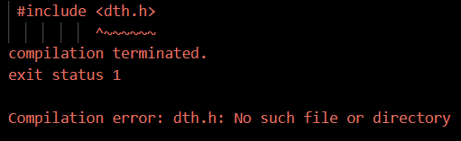
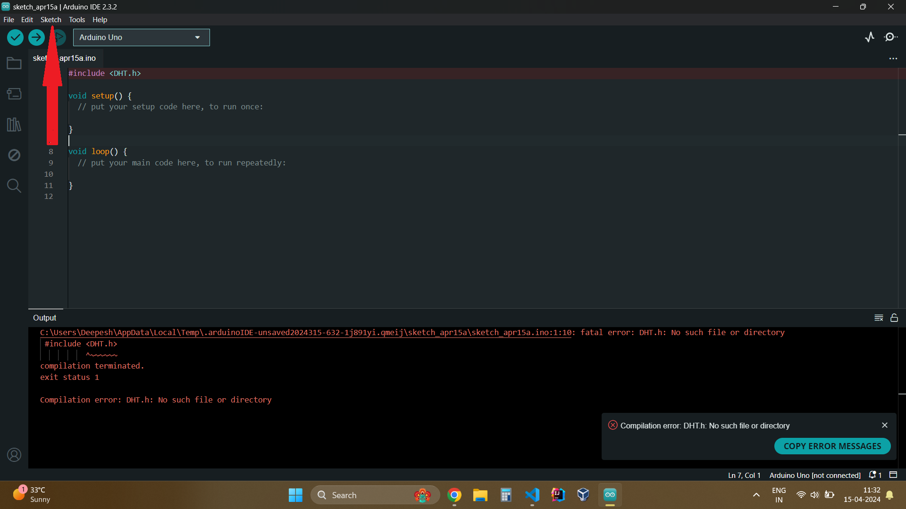
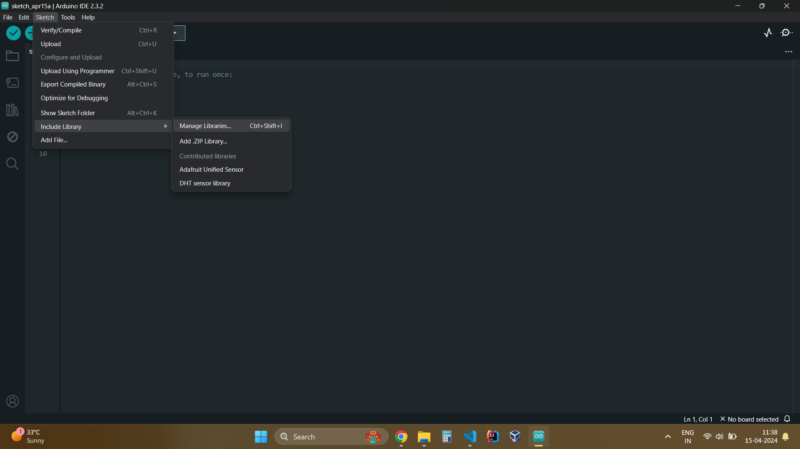
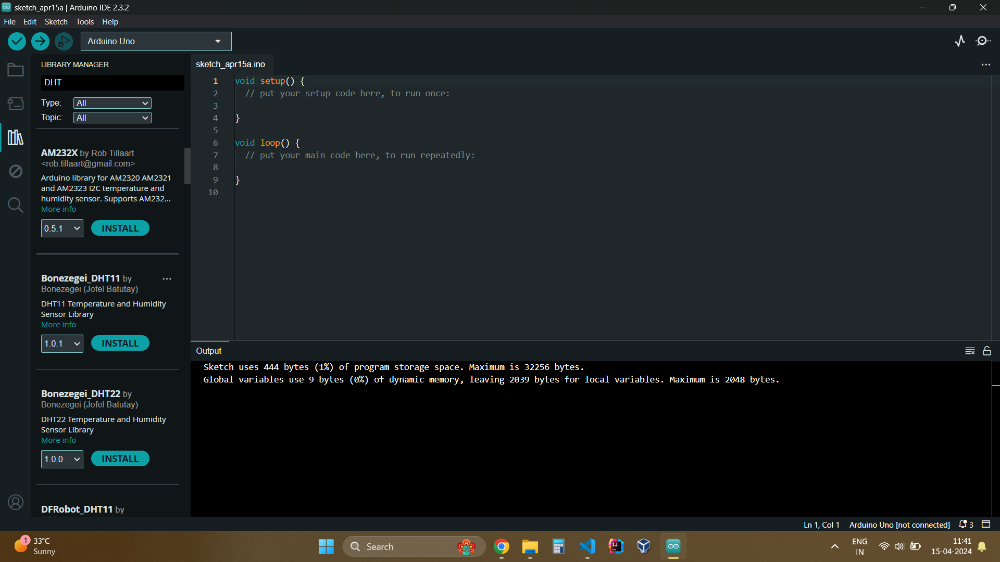
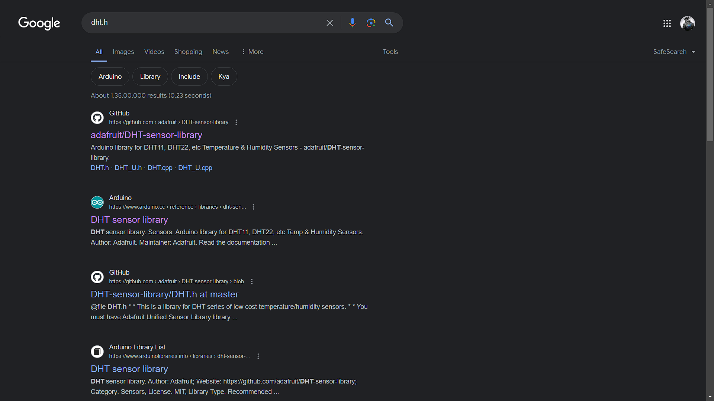
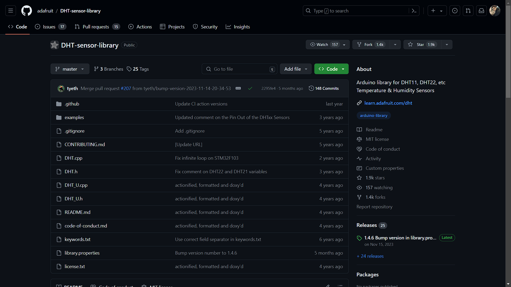
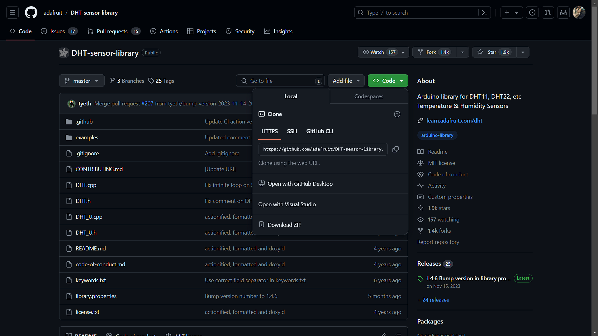
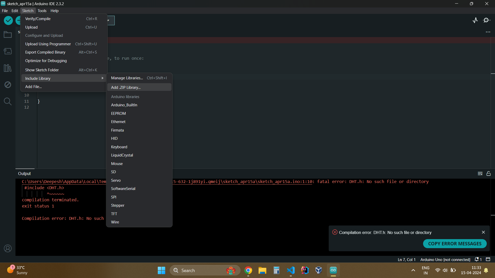
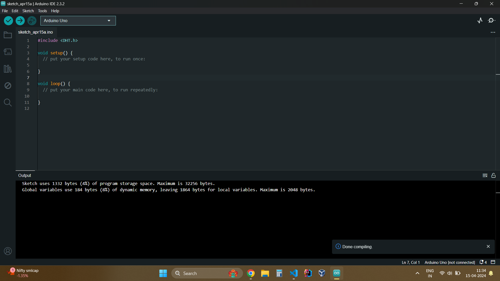

# Installing New Libraries for Arduino

## 📝 Introduction

This guide will walk you through the process of installing new libraries for the Arduino IDE. Libraries are collections of pre-written code that extend the functionality of the Arduino platform. If some library is missing, we get the following `Compilation Error` when we try to compile the code.

## 📋 Prerequisites

Before you begin, make sure you have the following:

- Arduino IDE installed on your computer. If not, you can download it from the [Arduino website](https://www.arduino.cc/en/software).
- Internet connection to access the Arduino Library Manager.

## 🛠️ Steps to Install Libraries

### 📦 Using Library Manager

1. Open the Arduino IDE on your computer.

2. Navigate to the `Sketch` menu and select `Include Library` > "Manage Libraries...".

3. In the Library Manager window, you can search for libraries by name using the search bar at the top right corner.

4. Once you find the library you want to install, click on the `Install` button.

5. Wait for the Arduino IDE to download and install the library. You'll see a progress bar indicating the installation process.

6. Once the library is installed, you can close the Library Manager.

7. You can now use the functions and features provided by the library in your Arduino sketches.

### 📚 Using Downloaded Zip

1. Search for the required module on a web browser.

2. Download the `zip` format of the library, either from [GitHub](https://github.com) or from the official website of [Arduino](https://www.arduino.cc/reference/en/libraries/)

-Website:

- Github:

3. Once the `zip` is downloaded, open the Arduino IDE

4. Navigate to Library Manager: Go to the `Sketch` menu and then select `Include Library` > `Add .ZIP Library`. 

5. Select the downloaded zip, and its done.
 

## ℹ️ Additional Information

- Some libraries may require additional setup or configuration. Make sure to check the documentation provided by the library author for any specific instructions.

- If you encounter any issues during the installation process, you can visit the [Arduino Forum](https://forum.arduino.cc/) or the [Arduino Stack Exchange](https://arduino.stackexchange.com/) for assistance.

- Remember to keep your libraries up to date by regularly checking for updates in the Library Manager.

## 🎉 Conclusion

Installing new libraries for Arduino is a simple process that allows you to extend the functionality of your projects. By following the steps outlined in this guide, you'll be able to install libraries and access their features in no time.

