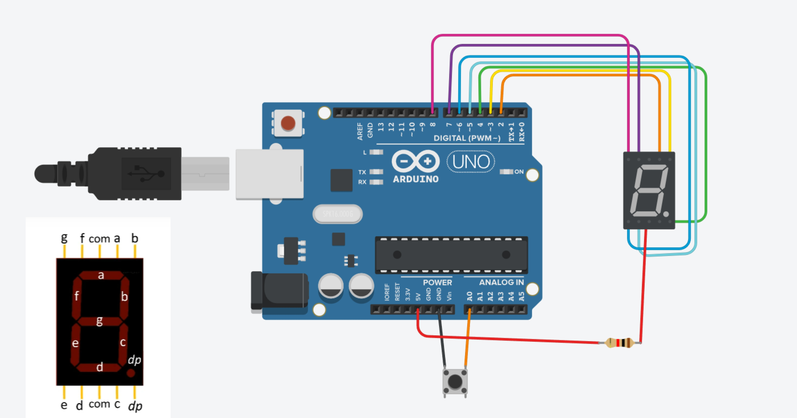

# 🚀 Dice with 7 segment display

This project demonstrates how to use Temperature Sensor and a Gas Sensor to build a fire alarm System 

## 🛠️ Components Needed

- 🛡️ Arduino (UNO R3)
- 🔴 7 Segment Display
- ⚡ Resistor - 1
- 🪢 Jumper wires
- ⚙️ Breadboard
- 🔘PushButton

## 🖇️ Circuit Diagram


1. **Dice with 7-segment display:**   
    `Power` -> Arduino 5V
    `GND` -> Arduino `GND`
    `Vout` -> Arduino `A0`
2. **7 Segment Display Connection:**
    - Common -> connected to power along with resistance
    - a -> Arduino 2
    - b -> Arduino 3
    - c -> Arduino 4
    - d -> Arduino 5
    - e -> Arduino 6
    - f -> Arduino 7
    - g -> Arduino 8


## 📜 Code 
```Cpp
//dice ka program
#define ap 2
#define bp 3
#define cp 4
#define dp 5
#define ep 6
#define fp 7
#define gp 8

#define button A0


const unsigned int freq =3000;

int on=1;
int off=0;

void setup(){

  pinMode(ap, OUTPUT);
  pinMode(bp, OUTPUT);
  pinMode(cp, OUTPUT);
  pinMode(dp, OUTPUT);
  pinMode(ep, OUTPUT);
  pinMode(fp, OUTPUT);
  pinMode(gp, OUTPUT);
  
  pinMode(button, INPUT_PULLUP);
}

void loop(){
  int buttonstate=digitalRead(button);
  if(buttonstate==HIGH){
    int number = random(1,7);
    showNumber(number);
  }
  delay(5000);
}

void showNumber(int num){
  switch(num){
    case 1: one();
    break;
    case 2: two();
    break;
    case 3: three();
    break;
    case 4: four();
    break;
    case 5: five();
    break;
    case 6: six();
    break;
    default: zero();
    break;
  }
}
void one(){
  digitalWrite(ap, HIGH);
  digitalWrite(bp, LOW);
  digitalWrite(cp, LOW);
  digitalWrite(dp, HIGH);
  digitalWrite(ep, HIGH);
  digitalWrite(fp, HIGH);
  digitalWrite(gp, HIGH);
}

void two(){
  digitalWrite(ap, LOW);
  digitalWrite(bp, LOW);
  digitalWrite(cp, HIGH);
  digitalWrite(dp, LOW);
  digitalWrite(ep, LOW);
  digitalWrite(fp, HIGH);
  digitalWrite(gp, LOW);
}

void three(){
  digitalWrite(ap, LOW);
  digitalWrite(bp, LOW);
  digitalWrite(cp, LOW);
  digitalWrite(dp, LOW);
  digitalWrite(ep, HIGH);
  digitalWrite(fp, HIGH);
  digitalWrite(gp, LOW);
}
void four(){
  digitalWrite(ap, HIGH);
  digitalWrite(bp, LOW);
  digitalWrite(cp, LOW);
  digitalWrite(dp, HIGH);
  digitalWrite(ep, HIGH);
  digitalWrite(fp, LOW);
  digitalWrite(gp, LOW);
}
void five(){
  digitalWrite(ap, LOW);
  digitalWrite(bp, HIGH);
  digitalWrite(cp, LOW);
  digitalWrite(dp, LOW);
  digitalWrite(ep, HIGH);
  digitalWrite(fp, LOW);
  digitalWrite(gp, LOW);
}
void six(){
  digitalWrite(ap, LOW);
  digitalWrite(bp, HIGH);
  digitalWrite(cp, LOW);
  digitalWrite(dp, LOW);
  digitalWrite(ep, LOW);
  digitalWrite(fp, LOW);
  digitalWrite(gp, LOW);
}
void zero(){
  digitalWrite(ap, LOW);
  digitalWrite(bp, LOW);
  digitalWrite(cp, LOW);
  digitalWrite(dp, LOW);
  digitalWrite(ep, LOW);
  digitalWrite(fp, LOW);
  digitalWrite(gp, HIGH);
} 
```
## Image : 



## Precautions

- Ensure proper connections to avoid any short circuits.

