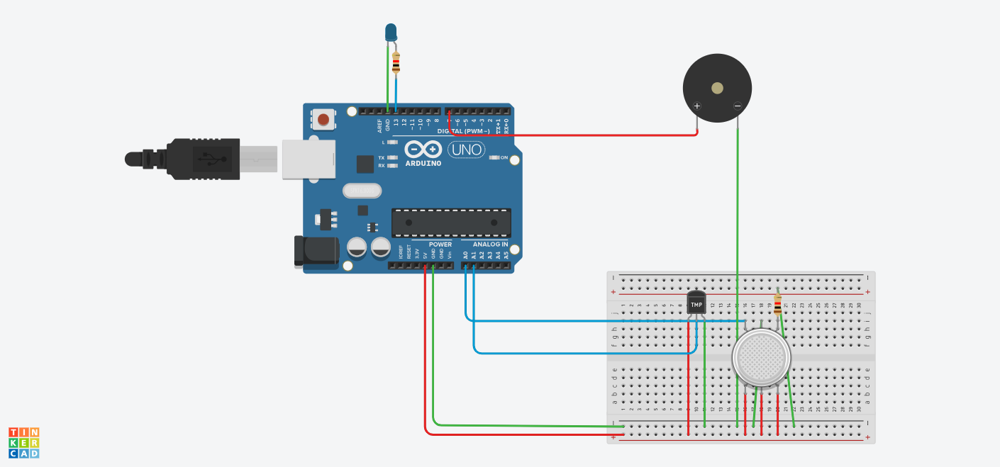

# 🚀 Arduino Fire Alarm System

This project demonstrates how to use Temperature Sensor and a Gas Sensor to build a fire alarm System 

## 🛠️ Components Needed

- 🛡️ Arduino (UNO R3)
- 🔴 Temperature Sensor (TMP36-LM35)
- 💡 LED (any color)
- ⚡ Resistor - 2(for LED and Gas Sensor)
- 🪢 Jumper wires
- Gas Sensor
- ⚙️ Breadboard

## 🖇️ Circuit Diagram

1. **Temperature Sensor Connections:**
   - `Vout` -> Arduino `A1`
   - `GND` -> Arduino `GND`
   - `Power` -> Arduino 5V

2. **LED Connections:**
   - Positive leg (longer) -> Arduino digital pin (e.g., pin 13) via a 220-ohm resistor
   - Negative leg (shorter) -> Arduino `GND`

3. **Gas Senor Conncections:**   
   - Pin A1 -> Arduino A0
   - Pin H1 -> Arduino `GND`
   - Terminal-1 -> To a 220-ohm Resistor and grounded
   - B1, H2, B2 pins -> Arduino `5V`
4. **Piezo Buzzer Connections**
   - Positive terminal -> Arduino `Digital-7`
   - Negative terminal -> Arduino `GND`


## 📜 Code 
```Cpp
float temp;
float vout;
float vout1;
int LED=13;
int gasSensor;
int piezo=7;

void setup()
{
  pinMode(A0,INPUT);
  pinMode(A1,INPUT);
  pinMode(LED,OUTPUT);
  pinMode(piezo,OUTPUT);
  Serial.begin(9600);
} 

void loop()
{
  vout=analogRead(A1);
  vout1=(vout/1023)*5000;
  temp=(vout1-500)/10;
  gasSensor=analogRead(A0);
  if(temp>=80)
  {
    digitalWrite(LED,HIGH);
  } 
  else
  {
    digitalWrite(LED,LOW);
  } 
  if(gasSensor>=100)
  {
    digitalWrite(piezo,HIGH);
  } 
  else
  {
    digitalWrite(piezo,LOW);
  }  
  Serial.print("In Degree C = ");
  Serial.print(temp);
  Serial.print("\t");
  Serial.print("Gas Sensor = ");
  Serial.print(gasSensor);
  Serial.println();
  delay(2000);
}  
```
## Circuit Diagram : 


## 🚦 How It Works

1. When the Smoke accumulates(i.e, increase in concentration) near the Gas Senor the piezo buzzer rings alerting peoplpe
2. Also using the controls we can alter the temperature such that the according to the temperature range the `LED` goes **HIGH** and **LOW**
3. Using the controls on board we can also control the Smoke accumulated near Gas Sensor to observe the difference in values

## 🛡️ Notes

- Ensure proper connections to avoid any short circuits.

## 🌟 Demo

When the Gas sensor detects smoke:
- The pizzo buzzer goes off. 💡

When no smoke is detected:
- The buzzer remains off. 🌙

The same happens with the LED in accordance with temperature levels that can be adjusted on board


---

Enjoy building your Fire Alarm System ! 🥳 Feel free to share any feedback or improvements. 🚀
