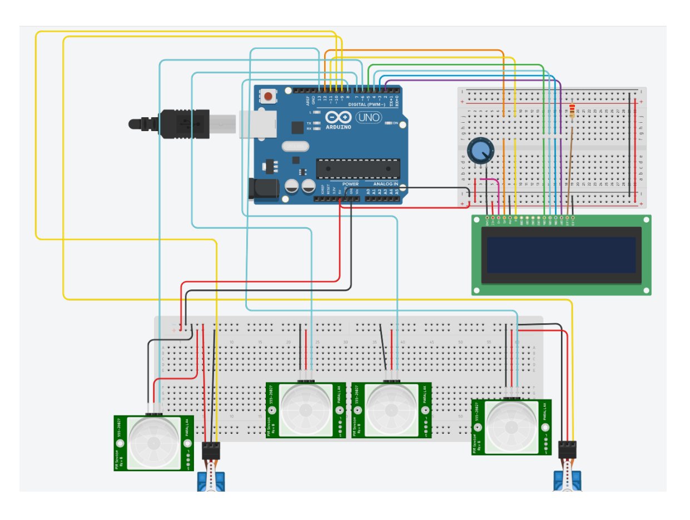

# 🚀 Project : Arduino Smart Parking System

This prototype shows how to build a Parking System using *Arduino* and other Components. 

## 🛠️ Components Needed

- 🛡️ Arduino (UNO R3)
- 🔴 PIR Sensors - 4 
- 💡 LCD (16 * 2)
- ⚡ Resistor - 1(for LCD)
- 🪢 Jumper wires
- ⚙️ Breadboard
- 🧧 Micro Servo(2)

## 🖇️ Circuit Diagram

1. **PIR Sensor Connections:**
   - `Signal` -> Arduino `Digital Pins `
   - `GND` -> Arduino `GND`
   - `Power` -> Arduino 5V

2. **LCD Connections:**
   - `LED Cathode` -> Arduino `GND`
   - `LED Anode` -> Resistor
   - `DB 7` -> Arduino `Digital PWM 2`
   - `DB 6` -> Arduino `Digital PWM 3`
   - `DB 5` -> Arduino `Digital PWM 4`
   - `DB 4` -> Arduino `Digital PWM 5`
   - `Power` -> Arduino `Power`
   - `Register Select` -> Arduino `12`

3. **Micro Servo Conncections:**   
   - `GND` -> Arduino `GND`
   - `Power` -> Arduino 5V
   - `Signal` -> Arduino Pins(9,10)

4. **Potentiometer Connections**
   - `Terminal 2` -> LCD `GND`
   - `Wiper` -> LCD `Contrast`
   - `Terminal 1` -> Arduino `5V`

## 📜 Code 
```Cpp
// C++ code
#include <LiquidCrystal.h>
#include<Servo.h>

Servo S1,S2;

#define IR_p1 7 //Parking Slot - 1
#define IR_p2 8 //Parking Slot -2 
#define IR_entry 6 //Sensor at entry
#define IR_exit 13 //Sensor at exit

int pos=0; //Used for controlling the Servo-motors those act as gates at entry and exit

LiquidCrystal lcd(12,11,5,4,3,2); //The pins that are connected to LED

void setup()
{
  S1.attach(10);
  S2.attach(9);
  
  S1.write(pos);
  S2.write(pos);
  
  pinMode(IR_p1, INPUT);
  pinMode(IR_p2, INPUT);
  pinMode(IR_entry, INPUT);
  pinMode(IR_exit, INPUT);
  
  lcd.begin(16,2);
  lcd.print("SMART PARKING");
  lcd.setCursor(0,1);
  lcd.print("    System");
  
  delay(1500); 
  
  lcd.clear();
  
  //At first both Slots are available
  lcd.setCursor(0,0); 
  lcd.print(" Slot - 1 = A ");
  lcd.setCursor(0,1);
  lcd.print(" Slot - 2 = A ");
  delay(1500);
}

void loop()
{
  if(digitalRead(IR_p1)==HIGH)
     {
       lcd.setCursor(0,0);
       lcd.print(" Slot - 1 = UA "); //Unavailable
     } 
  else
     {
       lcd.setCursor(0,0);
       lcd.print(" Slot - 1 = A "); //Avaialble
     }
   if(digitalRead(IR_p2)==HIGH)
     {
       lcd.setCursor(0,1);
       lcd.print(" Slot - 2 = UA ");
     } 
  else
     {
       lcd.setCursor(0,1);
       lcd.print(" Slot - 2 = A ");
     }
  
   if(digitalRead(IR_entry)==HIGH)
   {
     S1.write(pos+90); 
   } 
   else
   {
     S1.write(pos);
   }
    if(digitalRead(IR_exit)==HIGH)
   {
     S2.write(pos+90);
   } 
   else
   {
     S2.write(pos);
   }   
  
}
```
## Circuit Diagram : 


## 🚦 How It Works

- When a vehicle arrives at the parking area, the PIR sensors detect its presence and send a signal to the Arduino. 
- The Arduino processes this information and updates the LCD display to show the number of available slots. 
- If there are available slots, the servo motor opens the entry gate to allow the vehicle to enter. 
- When a vehicle leaves, the sensors detect its departure, and the Arduino updates the slot count and opens the exit gate.

## 🛡️ Notes

- Ensure proper connections to avoid any short circuits.

- Double-check all wiring connections to ensure they are secure and correctly placed. Loose or incorrect connections can lead to malfunctioning of the system.

- Place the PIR sensors at appropriate locations to accurately detect the presence of vehicles. Avoid placing them in areas where they might be triggered by unintended movements.

## 🌟 Demo

- If you are using any online simulator or doing any prototype of the project,create an obstacle infront of sensor.
- When the PIR sensor detects any motion,it sends information to Arduino and LCD displays number of slots
- If there are slots available it opens the gate and the sensors in parking slots detect their and update their record.
- Now again create an obstacle at exit gate by showing vehicle has left the slot,The IR sensor displays the available slots again.

---

Enjoy building Smart Parking System project! 🥳 Feel free to share any feedback or improvements. 🚀
